*** Spring Security 내부구조 ***

SecurityContextHolder -> SecurityContext -> Authentication -> Principal & GrantAuthority


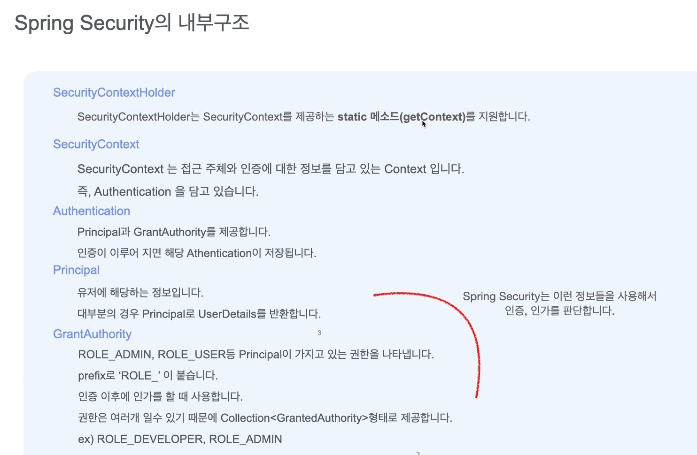

```java
SecurityContext securityContext = SecurityContextHolder.getContext(); // 해보면 securityContext.authentication.principal에 로그인 한 유자 정보가 담김
// User 엔티티의 정보가 담김
// 아무런 정보도 주지 않았는데 로그인 한 사람의 정보가 있는 이유는 ThreadLocal 덕분임
```


*** Security Filter ***  
요청이나 응답에 대해서 filtering 으로 감싸는 객체  
doFilter 메소드를 무조건 구현하도록 되어있음  


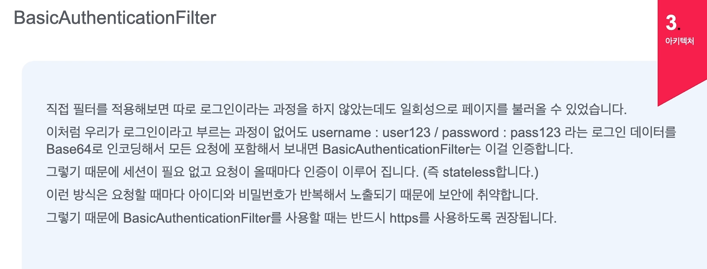

stateless하다는건 상태를 저장하지 않고 매 요청마다 인증을 다시 한다는 뜻  
매번 보내야하기 때문에 노출의 위험성이 큼  
명시적으로 http.httpBasic().disable(); 하는게 좋음


DaoAuthenticationProvider에서 this.getUserDetailsService().loadUserByUsername 부분은 SecurityConfig부분의 userDetailsService은 호출해서 유저정보를 가져옴. 이후 유저 체크가 이루어짐

*** CsrfFilter ***


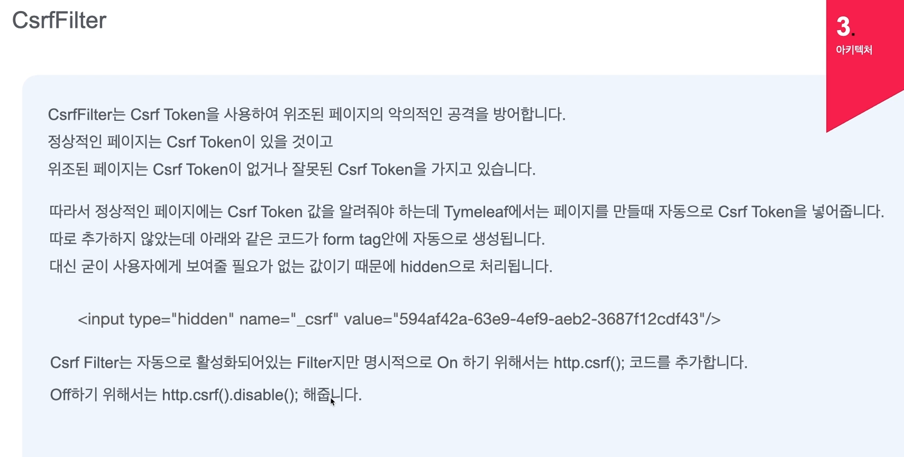

thymeleaf를 쓰면 페이지를 만들 때 자동으로 csrf 토큰을 포함시켜줌.  (따로 추가하지 않아도 input type="hidden" name="_csrf" value="..."/>가 추가됨)

*** FilterSecurityInterceptor ***

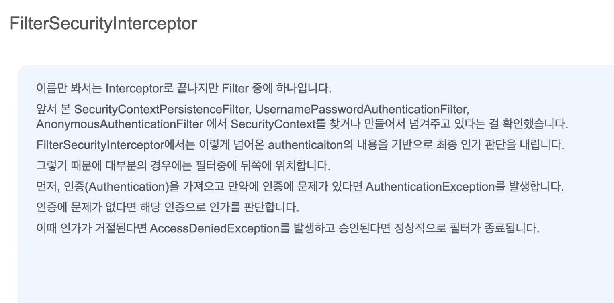

*** ExceptionTranslationFilter ***


*** Spring Security Config ***

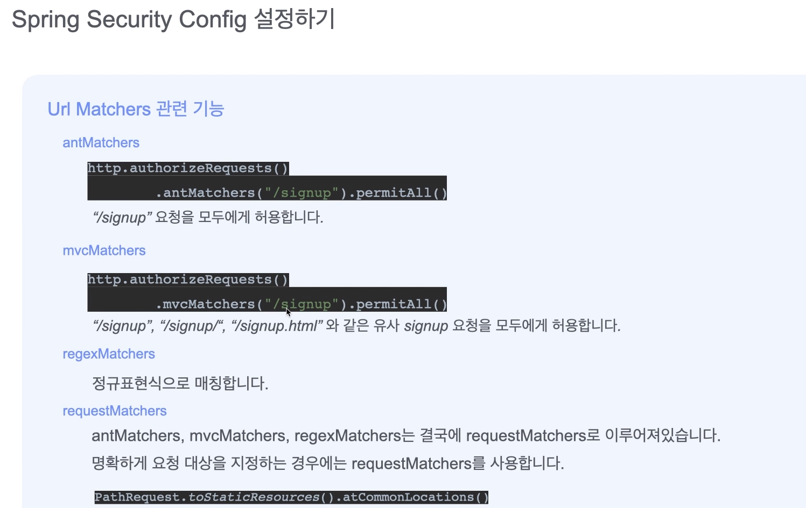


hasRole("ADMIN")에서 ROLE_가 빠져있는데 이건 기본으로 되어있음

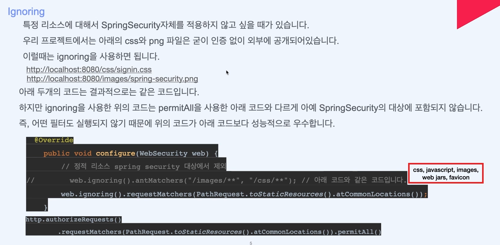

*** security test ***

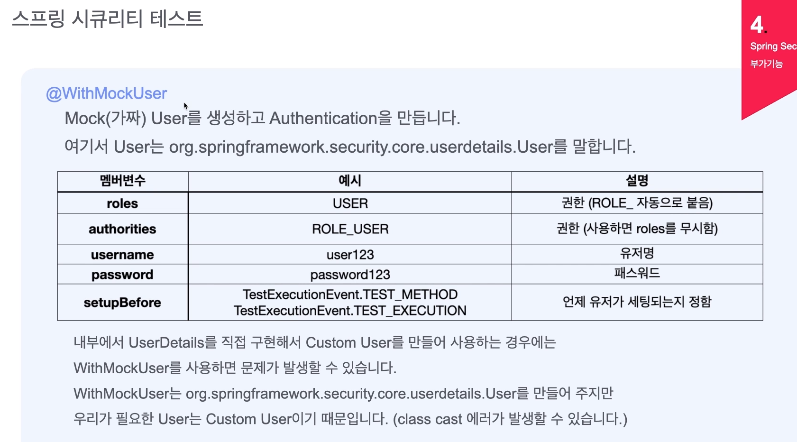

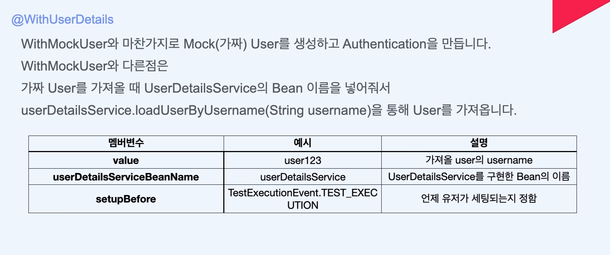

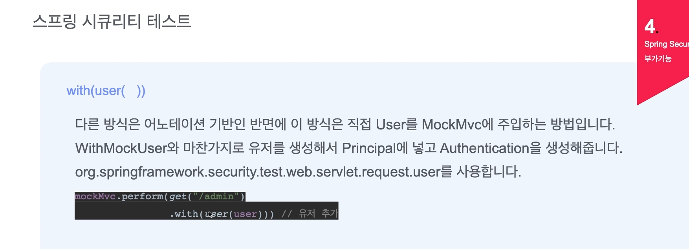

*** Session vs JWT ***

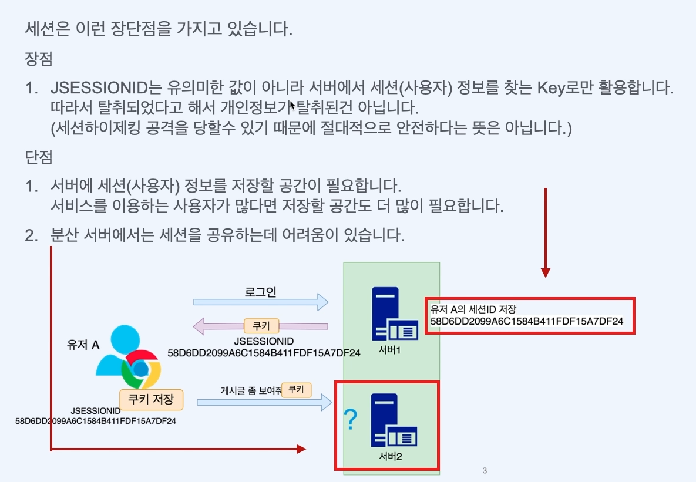

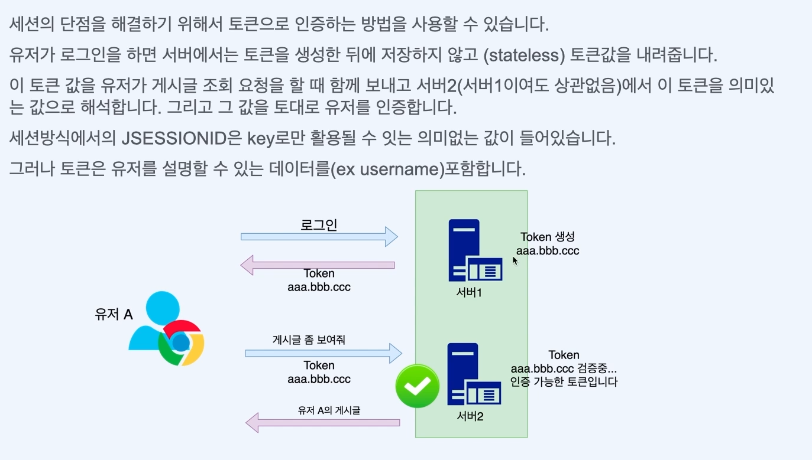

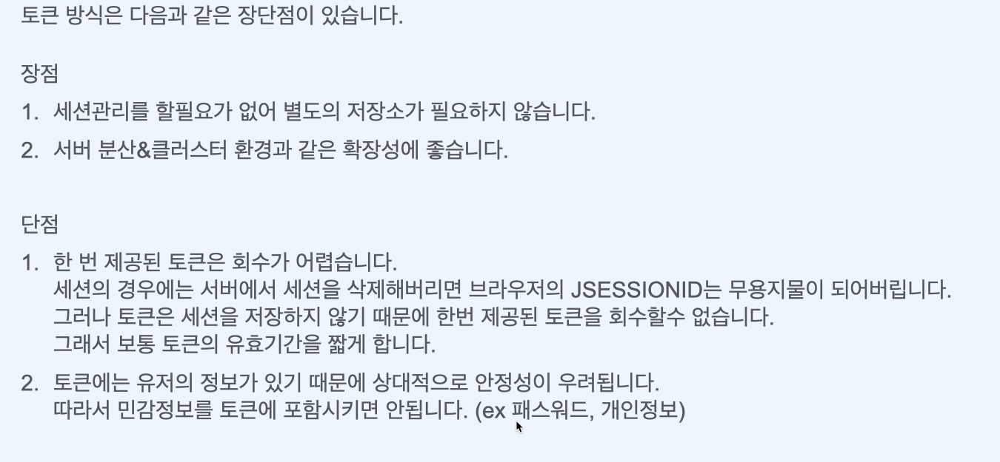

*** JWT ***


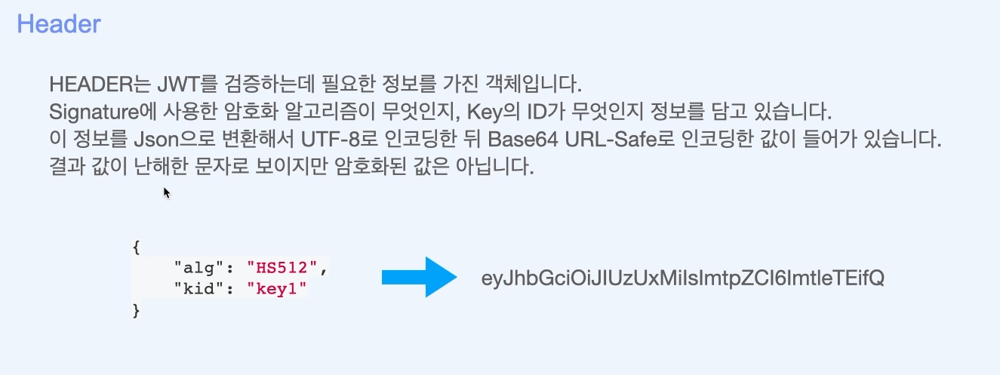


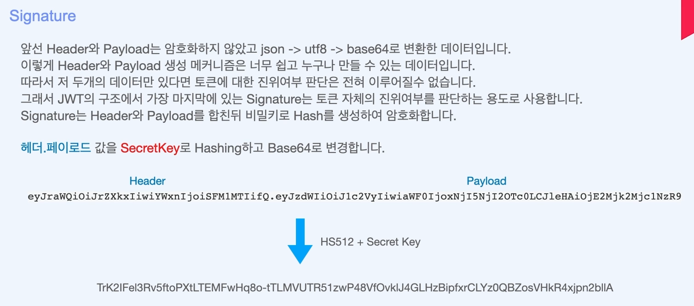


JwtKey는 JWT Secret Key를 관리하고 제공. Key Rolling (키 여러개 관리)를 지원  
JwtUtils - JWT 토큰을 생성하거나 Parsing하는 메소드를 제공  
SigningKeyResolver - JWT의 헤더에서 kid를 찾아서 Key(SecretKey+알고리즘)를 찾아옴. Signature검증할 때 사용